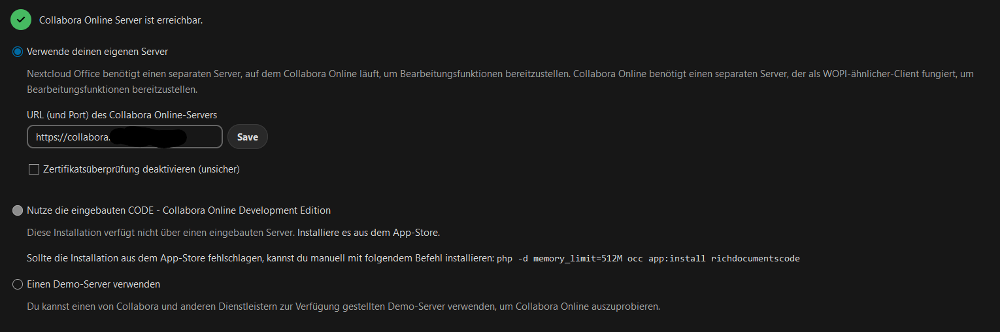

# Nextcloud-Collabra Docker-Compose (NPM Ready)

Nextcloud ist eine private Cloudlösung, ähnlich wie Dropbox aber anpassbar. In diesem Stack wird Collabra mitinstalliert, welches eine Office-Suite bereitstellt.

Projekt: [Nextcloud](https://nextcloud.com/)
Dokumentation: [Nextcloud Image Readme](https://github.com/docker-library/docs/blob/master/nextcloud/README.md)

Konfiguration:
1. Nach dem ersten Start die Nextcloud Domain aufrufen und ein Admin Benutzer & Passwort festlegen. Die restliche Initialisierung läuft automatisch.
2. Oben Rechts auf Usericon -> Apps -> Nextcloud Office Herunterladen und Aktivieren für die Collabora einbindung.
3. Usericon -> Verwaltungs-Einstellungen -> Nextcloud Office auf "Verwende deinen eigenen Server" auswählen und die Collabora URL eintragen.

4. Allow list for WOPI requests: 172.0.0.0/8 eintragen (Internes Docker IP Netz)
5. Datenverzeichnis des Nextcloud Containers öffnen und der config/config.php folgendes hinzufügen:
  'default_language' => 'de',
  'default_locale' => 'de',
  'default_phone_region' => 'DE',

Troubleshooting:
- Office Daten können nicht gespeichert werden: Bitte schau mal in die config/config.php des nextcloud containers, wenn du dort folgendes siehst: "\\\OC\\\Memcache\\\Redis" und "\\\OC\\\Memcache\\\APCu", das muss aber so aussehen "\OC\Memcache\Redis" und "\OC\Memcache\APCu".
